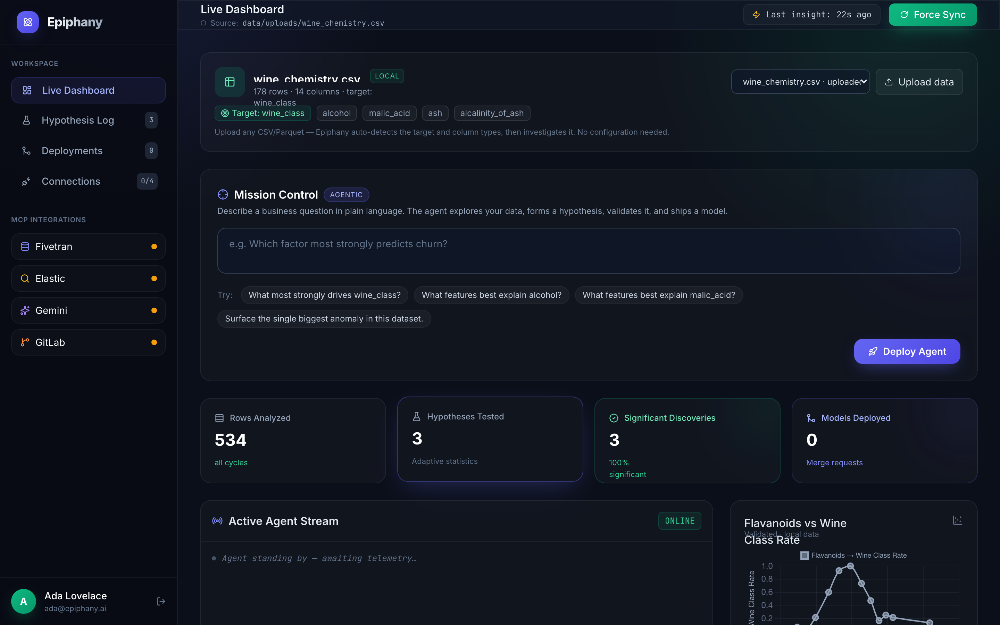
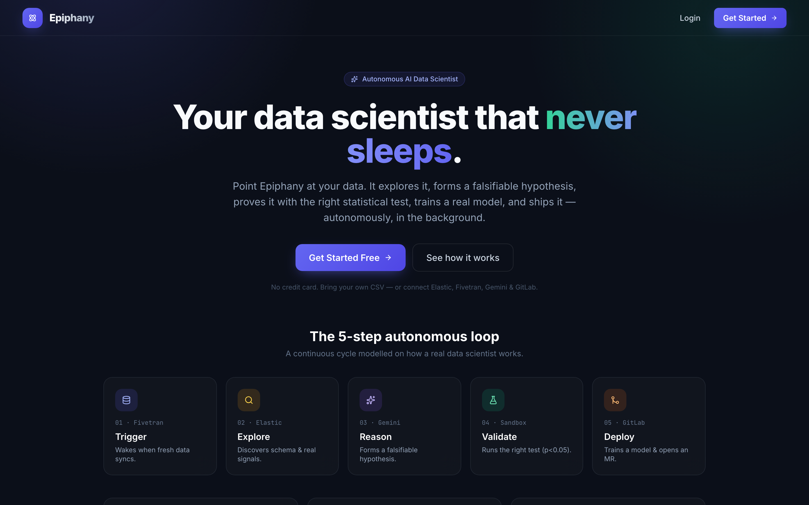

# Epiphany — Autonomous AI Data Scientist

> Built for the *Google Cloud Rapid Agent Hackathon*

Epiphany is an autonomous AI data scientist. Point it at a dataset and it runs
continuously in the background: it profiles the data, finds the strongest real
signals, forms a falsifiable hypothesis, **proves or disproves it with the right
statistical test**, trains a **real predictive model**, and writes up its
findings — autonomously. When enterprise credentials are present it does all of
this against live cloud data and ships the model as a GitLab Merge Request.

Everything it reports is computed from the data in front of it. There is no
synthetic data and no rigged result — a weak relationship comes back *not
significant*, exactly as it should.

**▶ Live demo: [epiphany-ds.fly.dev](https://epiphany-ds.fly.dev)**



<p align="center"><em>The live workspace — dataset card, Mission Control, real metrics, the agent stream, and the validated-discovery chart.</em></p>

## Screenshots

| Landing | Connections |
|---|---|
|  |  |

## The 5-Step Autonomous Loop

| # | Step       | Powered by            | Responsibility                                                  |
|---|------------|-----------------------|-----------------------------------------------------------------|
| 1 | **Trigger**  | Fivetran MCP        | Detect freshly-synced data (or read the local dataset).         |
| 2 | **Explore**  | Elastic MCP         | Discover the real schema and rank real feature↔target signals.  |
| 3 | **Reason**   | Gemini              | Form one falsifiable hypothesis grounded in the data profile.   |
| 4 | **Validate** | Python Sandbox      | Run the *right* test — χ² / t-test / ANOVA / correlation.        |
| 5 | **Deploy**   | GitLab MCP          | Train a real model, write a report, open a Merge Request.       |

When the **Google ADK** is installed and Gemini is configured, a managed
`LlmAgent` dynamically chooses which tools to call. Otherwise the same real
tools run as a direct pipeline — so the loop always completes.

## What makes it real (not a demo)

- **Adaptive statistics.** The test is chosen from the *actual* column types the
  agent discovers — Chi-Square for categorical pairs, Welch's t-test / one-way
  ANOVA for numeric-vs-group, Pearson/Spearman for numeric pairs — and run on
  real rows with a real effect size (Cohen's d, Cramér's V, η², |r|).
- **Real models.** On a significant finding, Epiphany trains a scikit-learn
  pipeline (impute → encode → gradient boosting), measures held-out ROC-AUC / F1
  (or R²), cross-validates it, and **saves a loadable `.pkl` artifact** plus a
  metrics JSON to `artifacts/`.
- **Real reports.** Every cycle writes a self-contained Markdown + HTML findings
  report to `reports/` — readable with no dashboard and no cloud account.
- **Real security.** Any agent-generated code is screened by an AST scanner
  (denylist of `os`/`subprocess`/`eval`/…; allowlist of data-science libs) and
  executed in a hardened, network-isolated, resource-limited subprocess.

## Bring your own data — anyone can use it

Epiphany ships with **no sample data**. A new user starts with an **empty
workspace** and either **uploads a CSV/Parquet** or **connects a source** — then
the agent begins automatically on *their* data. Every external provider is
**optional**; each credential you add simply upgrades one step:

| You add…            | …and that step becomes                              |
|---------------------|-----------------------------------------------------|
| `GEMINI_API_KEY`    | Gemini writes the hypotheses (and drives the ADK).  |
| Elastic creds       | data is read live from your telemetry index.        |
| Fivetran creds      | the trigger reflects real sync manifests.           |
| GitLab token + `AUTO_DEPLOY=true` | the model ships as a Merge Request.   |

## Getting Started

```bash
# 1. Create a virtual environment and install dependencies
python3 -m venv .venv && source .venv/bin/activate
pip install -r requirements.txt

# 2. (Optional) configure providers — copy the template and fill in what you have
cp .env.example .env
#    The only things worth adding for a great experience:
#      GEMINI_API_KEY   → https://aistudio.google.com/apikey  (no GCP project)
#      DATA_CSV_PATH    → point at ANY CSV/Parquet to analyse your own data

# 3. Run the dashboard
uvicorn app.main:app --reload
```

Open **http://127.0.0.1:8000** — the autonomous loop starts immediately, the
Active Agent Stream types out live, and `artifacts/` + `reports/` fill up with
real models and findings. Click **Force Sync** (or use Mission Control) to run a
cycle against a specific business goal.

## How to use it

1. **Sign in.** From the landing page click **Get Started** and create an
   account. (With a `CLERK_PUBLISHABLE_KEY` set this is real Clerk auth; without
   one it's a local demo login so the app always works.)
2. **Watch it work.** The dashboard's **Active Agent Stream** shows the agent
   running its loop live — Trigger → Explore → Reason → Validate → Deploy — and
   the hero cards + **Actionable Interventions** table fill with every real
   hypothesis it tests (green = statistically significant).
3. **Use your own data.** In the **dataset card** at the top, click **Upload
   data** (any CSV/Parquet) or pick a bundled sample from the dropdown. Epiphany
   re-profiles it, auto-detects the target, and starts investigating — no setup.
4. **Ask a question.** In **Mission Control**, type a goal in plain English
   (e.g. *“What most strongly drives wine_class?”*) and click **Deploy Agent**.
   Gemini + the Google ADK then dynamically choose which tools to call.
5. **See the results.** The right column shows the **validated-discovery chart**,
   the **trained-model metrics**, and the **generated model code** (syntax-
   highlighted). The **Hypothesis Log** and **Deployments** views (left nav) hold
   the full history; reports and `.pkl` models are also written to disk.
6. **Connect providers (optional).** The **Connections** page lets you paste your
   own Gemini / Elastic / Fivetran / GitLab credentials and apply them live — no
   restart, secrets never sent back to the browser.

### Use any dataset — for anyone, any domain

Epiphany is **not** tied to one domain. It auto-profiles whatever columns it
finds (numeric / binary / categorical / identifier / text), picks a sensible
target (name + position + type heuristics), chooses the right test, and trains a
model — whether your data is churn, housing prices, wine chemistry, or sensor
logs. Three ways to give it data:

1. **Upload in the app** — the dashboard's **dataset card** has an *Upload data*
   button (CSV/Parquet). The agent re-profiles and starts investigating it
   instantly.
2. **Point at a path** — `DATA_CSV_PATH=/path/to/your.csv uvicorn app.main:app`.
3. **Connect Elastic** — from the Connections page, to analyse a live index.

It adapts the **method to the data**, automatically — for example:

| If your target is… | …it picks |
|---|---|
| a 2-class label (e.g. converted yes/no) | Welch's **t-test** → classifier |
| a 3+-class category (e.g. product tier) | **ANOVA** → classifier |
| a continuous number (e.g. price) | **Pearson/Spearman** → regression |
| two categories (e.g. region × outcome) | **Chi-Square** |

### Connect providers from the UI

No `.env` editing required: the dashboard's **Connections** page lets you paste
your Gemini / Elastic / Fivetran / GitLab credentials and apply them live (the
agent reconfigures without a restart). Secrets are stored locally and never sent
back to the browser.

### Deploy

```bash
# Docker (works on Cloud Run, Render, Railway, Fly, …)
docker build -t epiphany .
docker run -p 8000:8000 --env-file .env epiphany     # $PORT is honored if set
```

The image runs as a non-root user and reads all configuration from the
environment (or the in-app Connections page). For a creds-free demo, set
`FORCE_SIMULATION=true` — analysis stays real on the local dataset; only outbound
provider calls are disabled.

### Endpoints

| Method | Path                      | Description                                  |
|--------|---------------------------|----------------------------------------------|
| GET    | `/`                       | Renders the Epiphany dashboard.              |
| GET    | `/health`                 | Readiness/liveness probe.                    |
| GET    | `/api/agent/status`       | Live vs. local mode per provider + data source. |
| POST   | `/api/agent/run`          | Trigger a cycle (optional `{"user_goal": …}`). |
| GET    | `/api/agent/dataset`      | Summary of the dataset under analysis (target, columns, suggestions). |
| POST   | `/api/agent/upload-dataset` | Upload a CSV/Parquet and analyse it.       |
| GET/POST | `/api/agent/connections` · `/connect` | Read status / connect providers live (secrets never echoed). |
| GET    | `/api/agent/hypotheses`   | Recorded hypotheses (newest first).          |
| GET    | `/api/agent/deployments`  | Recorded merge requests.                     |
| GET    | `/api/agent/latest-insight` | The latest validated relationship, for the chart. |
| WS     | `/ws/agent-stream`        | Live structured agent log stream.            |

## Project Structure

```
Epiphany/
├── app/
│   ├── main.py                      # App factory + lifespan (background loop)
│   ├── config.py                    # env-driven provider + data wiring
│   ├── routers/                     # dashboard, websocket, agent API
│   └── services/
│       ├── agent_orchestrator.py    # the 5-step loop (ADK agent or pipeline)
│       ├── data_port.py             # REAL DataFrame load + column profiling
│       ├── statistics.py            # adaptive test selection + execution
│       ├── sandbox.py / sandbox_worker.py  # AST security + isolated execution
│       ├── model_trainer.py         # REAL scikit-learn training + artifacts
│       ├── model_generator.py       # renders the committed model script
│       ├── report.py                # local Markdown/HTML findings report
│       ├── repository.py            # SQLite history of every cycle
│       └── clients/                 # Fivetran, Elastic, Gemini, GitLab
├── data/uploads/                    # user-uploaded datasets (bring your own)
├── artifacts/                       # trained models (.pkl) + metrics (.json)
├── reports/                         # findings reports (.md / .html)
├── .env.example                     # configuration template
└── requirements.txt
```

## Pitch materials

- **Slide deck:** [`docs/Epiphany_Pitch.pptx`](docs/Epiphany_Pitch.pptx)
- **Pitch & demo script:** [`docs/PITCH_SCRIPT.md`](docs/PITCH_SCRIPT.md)

## License

Released under the [MIT License](LICENSE) © 2026 Om Singhal.
