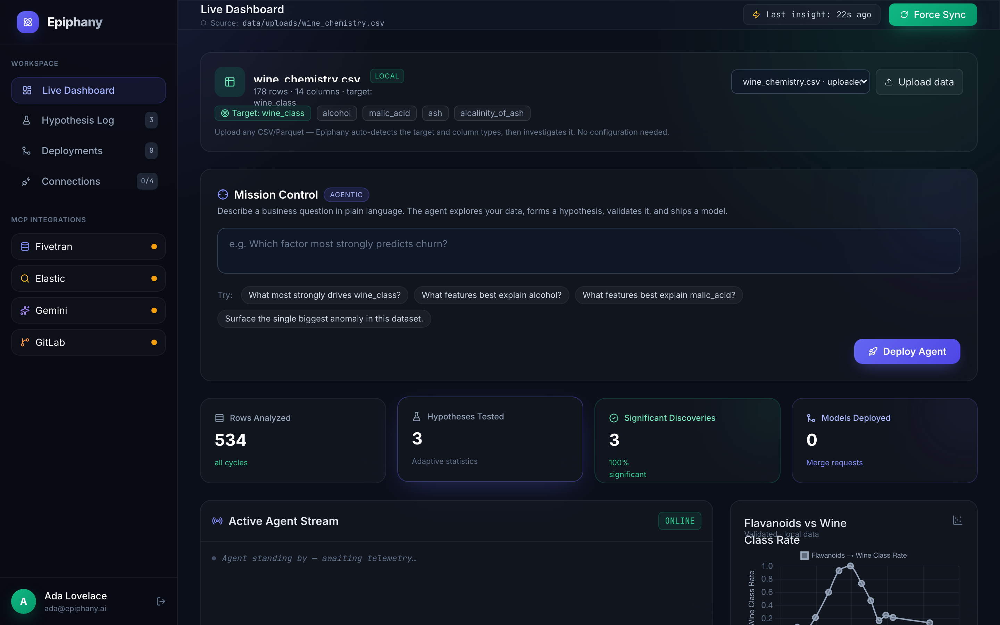
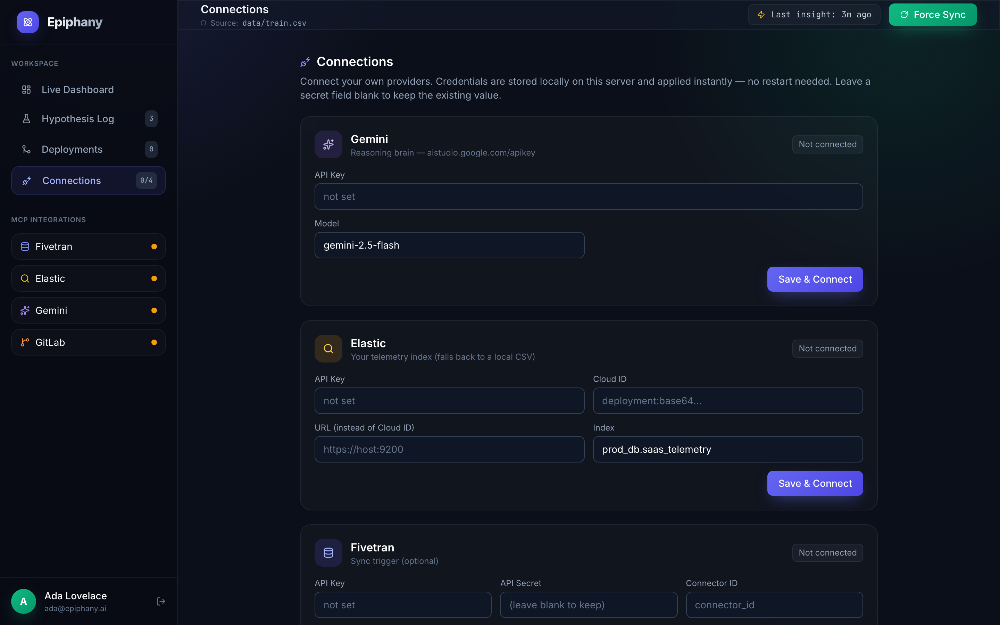

<div align="center">

# ✦ Epiphany

### The autonomous AI data scientist that never sleeps

**Drop in any dataset. Get a statistically-validated insight and a trained model — automatically.**

[](https://epiphany-ds.fly.dev)
&nbsp;
[](LICENSE)

[](https://ai.google.dev)
[](https://google.github.io/adk-docs/)
[](https://fastapi.tiangolo.com)
[](https://scikit-learn.org)

<br/>



</div>

---

## Your data has answers. Epiphany finds them — on its own.

Every team is sitting on data nobody has time to analyze. Hiring a data scientist is
slow and expensive. Most “AI for data” tools just *describe* your spreadsheet or spit
out code you still have to run and trust.

**Epiphany is different. It actually does the data science.**

It’s an autonomous agent that runs continuously in the background and, with **no human
in the loop**, it:

> 🔎 explores your data → 💡 forms a falsifiable hypothesis → 🧪 **proves it with the
> right statistical test** → 🤖 trains a real ML model → 📦 reports the result.

No dashboards to configure. No queries to write. No data scientist to hire.
**Just upload a CSV — and watch it think.**

<div align="center">

### → [Try the live demo](https://epiphany-ds.fly.dev) ←

</div>

---

## How it works

Epiphany runs a continuous **5-step loop**, modeled on how a real data scientist works.
Every step is real — not a scripted demo.

| | Step | Powered by | What actually happens |
|---|------|-----------|------------------------|
| **1** | **Trigger** | Fivetran | Wakes the moment new data lands. |
| **2** | **Explore** | Elastic | Discovers your schema and ranks the strongest real signals. |
| **3** | **Reason** | **Gemini + Google ADK** | An LLM agent forms one falsifiable, business-relevant hypothesis. |
| **4** | **Validate** | Python + SciPy | Runs the *correct* test — χ², t-test, ANOVA, or correlation — on your real rows. |
| **5** | **Deploy** | GitLab | Trains a real scikit-learn model and opens it as a Merge Request. |

When Gemini and the Google Agent Development Kit are connected, a managed agent
**dynamically decides which tools to call** to answer your question. The result streams
to a live dashboard so you can literally watch the agent reason, query, validate, and ship.

---

## Why Epiphany wins

🎯 **Real statistics, not vibes.**
Tests run with SciPy on your actual data. A weak relationship comes back *not
significant* — it can say “no.” Models are genuinely trained and scored (real
ROC-AUC / R²) and saved as loadable `.pkl` artifacts.

📂 **Works on *any* dataset, any domain.**
Upload a CSV and it auto-detects column types and the target, then picks the right
test and model — churn, pricing, healthcare, sensors, anything. Zero configuration.

🤖 **Genuinely autonomous.**
A background loop investigates on its own and rotates through questions. The agent
chooses its own tools via the Google ADK — agentic, not a fixed script.

🔒 **Safe by design.**
Any agent-generated code is screened by an AST security scanner and executed in a
network-isolated, resource-limited sandbox.

🌐 **Live and usable.**
Real sign-in, bring-your-own-data upload, and connect-your-own-API — all from the browser.

---

## See it in action

| Sign up & sign in | Connect your own providers |
|---|---|
|  |  |

**The flow:** sign in → your workspace starts empty → **upload a CSV** (or connect Elastic)
→ the agent auto-detects the target and starts working → ask it a question in plain English
→ get a validated finding, a trained model, and the generated code.

---

## Try it yourself

**▶ Hosted:** **[epiphany-ds.fly.dev](https://epiphany-ds.fly.dev)** — sign up and upload a dataset.

**💻 Run locally:**

```bash
pip install -r requirements.txt
uvicorn app.main:app
# open http://127.0.0.1:8000, sign in, and upload a CSV
```

Add a free [Gemini API key](https://aistudio.google.com/apikey) (`GEMINI_API_KEY`) for
live LLM reasoning, and a [Clerk](https://clerk.com) publishable key
(`CLERK_PUBLISHABLE_KEY`) for real auth — both optional.

---

<div align="center">

**Built with** Google Gemini · Google Agent Development Kit · FastAPI · scikit-learn · SciPy · Chart.js · Clerk

Released under the **[MIT License](LICENSE)** · © 2026 Om Singhal

*Data science that runs itself.*

</div>
