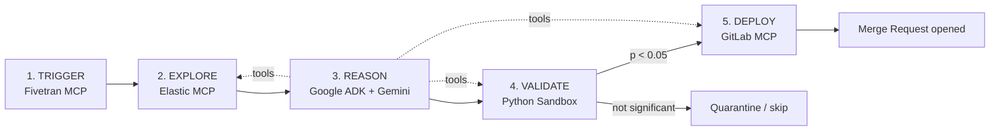

# Epiphany — Project Report

**An Autonomous AI Data Scientist**
Built for the *Google Cloud Rapid Agent Hackathon*

---

## 1. Executive Summary

**Epiphany** is an autonomous AI data scientist that runs continuously in the
background. Without a human in the loop, it wakes when fresh telemetry lands,
explores a live database, forms a falsifiable business hypothesis, proves or
disproves it with a real statistical test inside a hardened sandbox, and — only
when the result is statistically significant — autonomously authors a predictive
machine-learning model and opens it as a GitLab Merge Request for human review.

The entire pipeline streams to a live web dashboard so a viewer can watch the
agent think, query, reason, validate, and deploy in real time.

The defining quality of the system is **graceful degradation**: every external
provider (Fivetran, Elastic, Vertex AI, GitLab) falls back to a faithful,
deterministic simulation when its credentials are missing. The demo therefore
*always* completes end-to-end — live when configured, an on-topic simulation
otherwise.

---

## 2. The 5-Step Autonomous Loop

Epiphany's core is a continuous loop modelled on how a human data scientist
works:

| # | Step         | Powered by                | Responsibility                                              |
|---|--------------|---------------------------|-------------------------------------------------------------|
| 1 | **Trigger**  | Fivetran MCP              | Wake the agent when new telemetry data syncs.               |
| 2 | **Explore**  | Elastic MCP               | Discover the schema and run aggregations to find anomalies. |
| 3 | **Reason**   | Google ADK + Gemini 2.5   | Form one falsifiable business hypothesis.                   |
| 4 | **Validate** | Python Sandbox (SciPy)    | Run a real Chi-Square test (`p < 0.05`) in isolation.       |
| 5 | **Deploy**   | GitLab MCP                | Push a predictive ML model as a Merge Request.              |



---

## 3. System Architecture

Epiphany is a **FastAPI** application using the app-factory + lifespan pattern.
On boot, the orchestrator starts as a background `asyncio` task and runs cycles
forever, publishing structured events to an in-process event bus that fans them
out to every connected dashboard over a WebSocket.

```
Epiphany/
├── app/
│   ├── main.py                      # App factory + lifespan (boots the agent loop)
│   ├── config.py                    # pydantic-settings; env-driven provider wiring
│   ├── routers/
│   │   ├── dashboard.py             # GET / (Jinja2) + /health
│   │   ├── websocket.py             # WS /ws/agent-stream (event-bus subscriber)
│   │   └── agent.py                 # /api/agent/* control + data endpoints
│   ├── services/
│   │   ├── agent_orchestrator.py    # The 5-step loop; Google ADK driver + simulation
│   │   ├── events.py                # AgentLogEvent schema + in-process EventBus
│   │   ├── repository.py            # Async SQLite cycle/hypothesis/deployment history
│   │   ├── sandbox.py               # AST security scanner + SciPy validation
│   │   ├── sandbox_worker.py        # Hardened subprocess for the Chi-Square test
│   │   ├── code_exec_worker.py      # Killable subprocess for untrusted generated code
│   │   ├── model_generator.py       # Renders the deployed model script
│   │   └── clients/
│   │       ├── fivetran_client.py   # Step 1 — Trigger
│   │       ├── elastic_client.py    # Step 2 — Explore + MCP toolset
│   │       ├── gemini_client.py     # Step 3 — Reason (Vertex AI, legacy path)
│   │       └── gitlab_client.py     # Step 5 — Deploy
│   ├── static/                      # First-party JS/CSS
│   └── templates/
│       └── epiphany_dashboard.html  # Dashboard + live WebSocket client
├── scripts/
│   ├── seed_live_data.py            # Phase 6 — bulk-load Kaggle data into Elastic
│   ├── seed_elastic.py              # Helper seeding utility
│   ├── check_providers.py           # Provider auth/health probe
│   ├── test_sandbox_security.py     # Phase 4 — sandbox security test harness
│   └── test_phase5_deploy.py        # Phase 5 — end-to-end deploy verification
├── data/                            # Place train.csv here for live seeding
├── .env / .env.example              # Provider configuration
├── requirements.txt
└── README.md
```

### Request / data flow

1. `app.main:create_app()` builds the FastAPI app and mounts routers + static.
2. `lifespan()` instantiates `AgentOrchestrator`, initialises the SQLite
   repository, and launches `run_forever()` as a background task.
3. Each cycle emits `AgentLogEvent`s to the singleton `EventBus`.
4. `websocket.py` subscribes a per-client queue and streams events to the
   browser's "Active Agent Stream."
5. The dashboard polls `/api/agent/*` REST endpoints for metrics, the live
   chart, the latest model, and deployment history.

---

## 4. The Five Steps in Detail

### Step 1 — Trigger (Fivetran MCP)
`FivetranClient` polls the Fivetran REST API for a completed sync manifest
(table name, rows synced, schema captured). This is what "wakes" the agent.
Without credentials it returns a deterministic mock manifest.

### Step 2 — Explore (Elastic MCP)
`ElasticClient` is exposed as an **MCP-style database toolset** rather than a set
of hardcoded queries. It provides two capabilities the agent calls dynamically:

- **`get_database_schema()`** — introspects the active index mapping and returns
  its fields and data types (MCP "resource discovery"). The agent is explicitly
  told **not to assume column names** and to discover them first.
- **`execute_adhoc_aggregation(query_dsl)`** — runs an arbitrary Elasticsearch
  Query DSL aggregation that the agent itself authored (MCP "tool call").

`ElasticMcpToolset` bundles these two into the toolset handed to the agent. A
full simulation (mock enterprise schema + dynamic mock aggregation metrics)
keeps the loop working credential-free.

### Step 3 — Reason (Google ADK + Gemini 2.5)
The orchestrator builds a **Google Agent Development Kit (ADK)** `LlmAgent`
backed by Vertex AI `gemini-2.5-flash`. The Explore and Validate capabilities
are registered as **agent tools** (async functions ADK auto-wraps from their
type hints and docstrings). The agent is given the user's business goal and a
strict protocol:

1. Call `get_database_schema` (never assume columns).
2. Author an Elasticsearch aggregation and call `execute_adhoc_aggregation`.
3. Form one falsifiable hypothesis and call `validate_hypothesis`.
4. If — and only if — `p < 0.05`, call `deploy_model`.
5. Summarise the outcome.

If the ADK / Vertex path is unavailable (or `FORCE_SIMULATION=true`, or the
agent finishes without validating), the orchestrator falls back to a
**simulated cycle** that walks the same MCP tools deterministically — so the
narration is always coherent and on-topic.

### Step 4 — Validate (Python Sandbox)
`validate_hypothesis` runs a **real SciPy Chi-Square test** and computes a
genuine p-value. Crucially, this is wrapped in a hardened security layer (see
§5). The test executes inside a network-isolated, resource-limited subprocess so
it can never exfiltrate data or take down the API.

### Step 5 — Deploy (GitLab MCP)
When a hypothesis is significant, `model_generator.render_model_script()`
authors a Python XGBoost/Scikit-Learn classifier **driven entirely by the
validated feature and target** — no column names are hardcoded; it selects
numeric drivers at runtime and engineers the agent's threshold discovery as an
explicit signal. `GitLabClient.deploy_model()` then:

1. Creates a feature branch off `GITLAB_TARGET_BRANCH`.
2. Commits the generated model script.
3. Opens a Merge Request titled `feat: autonomous-prediction-model-[feature]`.

The orchestrator extracts the MR link and emits a final `GITLAB MCP` log,
closing the loop. In simulation it returns a mock URL
(`https://gitlab.com/mock/repo/-/merge_requests/42`) so the dashboard updates.

---

## 5. Security Hardening (Phase 4)

Because the agent runs **dynamically generated code**, the sandbox is the
project's most safety-critical component. It uses defense-in-depth:

1. **Static AST scan (`scan_code`)** — parses code with Python's `ast` module
   *before* any execution and raises `SecurityError` on:
   - imports of system modules (`os`, `sys`, `subprocess`, `shutil`, `socket`,
     `ctypes`, `pickle`, networking libraries, etc.),
   - forbidden builtins (`eval`, `exec`, `compile`, `__import__`, `open`,
     `getattr`, …),
   - dunder-attribute escapes (`__subclasses__`, `__bases__`, `__class__`),
   - anything outside an explicit import allowlist.
2. **Killable subprocess execution** — vetted code runs in a separate, hardened
   process (`code_exec_worker.py`) wrapped in `asyncio.wait_for`. On timeout the
   parent **kills** the process, so an infinite loop or hostile payload yields a
   safe error instead of hanging the server.
3. **Process hardening** — the worker blocks network egress (`socket.socket` is
   stubbed) and applies POSIX CPU/memory rlimits before running anything.
4. **Restricted globals** — execution sees only a curated `__builtins__` and an
   allowlisted set of data-science modules (pandas, numpy, scipy, sklearn,
   xgboost, …).
5. **Orchestrator gate** — `execute_python_sandbox` scans the generated code
   first; on violation it quarantines the hypothesis (`is_significant = False`),
   records `security.safe = False`, emits a `SANDBOX SECURITY` error, and denies
   deployment.

Verified behaviour: 9 malicious payloads are blocked, safe code runs, infinite
loops are killed with a `TimeoutError`, and legitimate model scripts pass.

---

## 6. Resilience: Graceful Degradation

Every provider has a `*_enabled` property in `config.py` gated on credentials
and `FORCE_SIMULATION`. When a provider is disabled:

- **Fivetran** → mock sync manifest.
- **Elastic** → mock enterprise schema + dynamically synthesised aggregation
  responses.
- **Gemini / ADK** → deterministic simulated reasoning loop over the same tools.
- **GitLab** → simulated Merge Request descriptor with a mock URL.

Two independent switches govern safety:

- **`FORCE_SIMULATION`** (default `false`) — forces *all* providers into
  simulation.
- **`AUTO_DEPLOY`** (default `false`) — a guard so the agent only opens **real**
  GitLab Merge Requests when explicitly enabled. Live cycles otherwise run
  fully but produce simulated MRs, so nothing is pushed unexpectedly.

---

## 7. The Dashboard (Frontend)

A single Jinja2 template (`epiphany_dashboard.html`) styled with Tailwind and
Chart.js (via CDN) provides:

- **Mission Control** — a text area + "Deploy Agent" button to dispatch a custom
  business goal (`POST /api/agent/run` with `{ user_goal }`), plus example
  chips.
- **Active Agent Stream** — a live, terminal-style log fed by the WebSocket;
  each line types out as the agent progresses, colour-coded by stage and tagged
  live vs. simulation.
- **Hero stat cards** — rows analysed, hypotheses tested, significant
  discoveries, models deployed (from `/api/agent/metrics`).
- **Live chart** — churn-rate-by-latency scatter from `/api/agent/scatter`.
- **Autonomous Deployment card** — branch, generated asset, and the Merge
  Request link.
- **Code view** — the most recent generated model script from
  `/api/agent/latest-model`.

### Key endpoints

| Method | Path                     | Description                                |
|--------|--------------------------|--------------------------------------------|
| GET    | `/`                      | Renders the dashboard.                     |
| GET    | `/health`                | Readiness/liveness probe.                  |
| GET    | `/api/agent/status`      | Live vs. simulation per provider; flags.   |
| POST   | `/api/agent/run`         | Trigger a cycle (optional `user_goal`).    |
| GET    | `/api/agent/hypotheses`  | Recorded hypotheses (newest first).        |
| GET    | `/api/agent/deployments` | Recorded merge requests.                   |
| GET    | `/api/agent/metrics`     | Aggregate metrics for the hero cards.      |
| GET    | `/api/agent/scatter`     | Churn-by-latency chart points.             |
| GET    | `/api/agent/latest-model`| Most recent generated model script.        |
| WS     | `/ws/agent-stream`       | Live structured agent log stream.          |

---

## 8. Persistence

`repository.py` is an async **SQLite** store (via `aiosqlite`) that records every
cycle, hypothesis, and deployment. It powers the dashboard's history views and
aggregate metrics (rows analysed, significance rate, models deployed, last
insight timestamp).

---

## 9. Technology Stack

- **Python 3.14** in a local `.venv`.
- **FastAPI / Starlette / Uvicorn** — web framework + ASGI server.
- **Google ADK 2.1** (`google-adk`) — agent orchestration.
- **Vertex AI** `gemini-2.5-flash` — reasoning model.
- **Elasticsearch** (async + sync clients) — telemetry store / MCP toolset.
- **SciPy / NumPy / pandas** — statistics and data handling.
- **aiosqlite** — cycle history persistence.
- **python-gitlab** — Merge Request automation.
- **Jinja2 + Tailwind + Chart.js** — dashboard UI.
- **pydantic-settings** — typed, env-driven configuration.

---

## 10. Development Phases

| Phase | Focus                                                                 |
|-------|-----------------------------------------------------------------------|
| 1     | Mission Control UI + `user_goal` routing.                             |
| 2     | Refactor orchestration onto **Google ADK**; Explore/Reason as tools.  |
| 3     | **MCP schema tool** (`get_database_schema`) + dynamic ad-hoc queries. |
| 4     | **Security hardening** — AST scanner + killable, isolated execution.  |
| 5     | **Autonomous deployment** — dynamic model + GitLab MR + final log.    |
| 6     | **Live data seeding** — bulk-load the Kaggle SaaS churn dataset.      |

---

## 11. Phase 6 — Live Data Seeding (current)

`scripts/seed_live_data.py` is a one-off loader that:

- reads `data/train.csv` (Kaggle *SaaS Customer Churn Prediction*) with pandas,
- builds an Elasticsearch client from the app settings,
- creates the index **`prod_db.saas_telemetry`** (dynamic mapping — no hardcoded
  columns), and
- bulk-inserts the rows via `helpers.bulk`.

Because the agent discovers the schema at runtime (Phase 3), it adapts to the
new dataset automatically. The default index in `config.py` and `.env` was
switched to `prod_db.saas_telemetry`.

### Running a fully live cycle

```bash
# 0) Place the Kaggle CSV at ./data/train.csv
mkdir -p data   # then drop train.csv inside

# 1) Activate the environment
source .venv/bin/activate

# 2) Seed the live index
PYTHONPATH=. python scripts/seed_live_data.py --recreate

# 3) In .env, confirm:
#    FORCE_SIMULATION=false
#    AUTO_DEPLOY=false              # keep false unless you want REAL MRs
#    ELASTIC_INDEX=prod_db.saas_telemetry

# 4) Launch
PYTHONPATH=. uvicorn app.main:app --host 127.0.0.1 --port 8000
```

Open **http://127.0.0.1:8000** and click **Deploy Agent** (or let the background
loop run). The agent inspects the live schema, authors its own aggregations,
validates a hypothesis on real data, and opens a (simulated) Merge Request.

---

## 12. How to Run (Quick Start)

```bash
python3 -m venv .venv
source .venv/bin/activate
pip install -r requirements.txt
cp .env.example .env          # fill in any creds you have; leave the rest blank
uvicorn app.main:app --reload # open http://127.0.0.1:8000
```

For a zero-credential demo, set `FORCE_SIMULATION=true` and everything runs as a
faithful simulation.

---

## 13. Design Principles

- **Idempotency** — steps are safe to retry; deploy reuses an existing branch
  and guards against double-shipping within a cycle.
- **Dynamic over hardcoded** — the agent discovers schema and writes its own
  queries; the model script adapts to whatever feature/target was validated.
- **Safety by default** — untrusted code is statically screened and executed in
  a killable, network-isolated, resource-limited subprocess; real deploys are
  gated behind `AUTO_DEPLOY`.
- **Always-on demo** — graceful degradation guarantees a coherent end-to-end run
  with or without credentials.

---

## 14. Security & Operational Notes

- Secrets live only in `.env` (git-ignored) and are never printed.
- `AUTO_DEPLOY` stays `false` by default — no real Git pushes without explicit
  opt-in.
- The repository contains real credential files (`*.json`, `*.csv`) at the root;
  these should remain git-ignored and never be committed or shared.

---

*End of report.*
